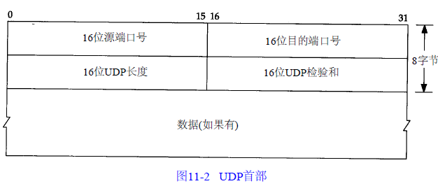

# 运输层
## UDP：用户数据报协议
### UDP首部

端口号表示发送进程和接收进程，IP层将数据报分配给TCP或UDP，因此TCP端口号和UDP端口号是相互独立的

UDP字段长度指的是UDP首部和UDP数据的字节长度，该字段的最小值为8

UDP校验和覆盖UDP首部和UDP数据，IP首部的校验和只包含IP首部数据

UDP收到报文校验失败后，这个报文会被丢弃，不产生任务差错报文

IP数据报分片后，只有到达目的地才进行重新组装，由目的主机IP层完成

## TCP：传输控制协议
TCP提供可靠的，面向连接的字节流服务

在一个TCP连接中，只有两方进行彼此通信

保证可靠性：
+ 应用程序数据被分割成TCP最适合发送的数据块，应用程序产生UDP数据报长度保持不变
+ TCP发送数据报之后，会启动一个定时器，等待接收方发送确认，如果超时，则会重发这个数据报
+ TCP接收到数据后，并不会立即发送确认
+ TCP使用首部的校验和对TCP数据进行校验
+ TCP对收到的数据报进行重新排序
+ TCP提供流量控制

TCP首部

TCP提供全双工，数据在两个方向独立传送，因此连接的每一端都保持数据序号

TCP将用户数据打包构成报文段，发送数据后启动一个定时器，另一端对接收到的数据进行确认，对失序的报文段进行重拍，丢弃重复数据，TCP提供端到端的流量控制，并计算和验证一个强制性的端到端校验和。

### TCP连接的建立和终止
TCP是一个面向连接的协议，在发送数据之前，都必须在双方之间建立一条连接，而UDP直接发送数据。

#### 建立连接的三次握手

+ 客户端发送一个SYN段指明客户请求建立连接，这个SYN段为1
+ 服务器发回SYN作为应答
+ 客户端发送ACK确认，至此连接建立

#### 关闭连接的四次握手
TCP连接是全双工的,因此每个方向必须进行单独的关闭

+ 主动关闭方发出FIN
+ 被动关闭方发送FIN信号的ACK确认，随后发送FIN
+ 主动关闭方接收到ACK，关闭连接，发送FIN信号的ACK确认
+ 被动方接收到ACK，关闭连接

#### 最大报文长度MSS
最大报文的长度表示TCP发送给另一端的最大数据块的长度

#### TCP半关闭
TCP提供连接的一端在结束发送之后，还能接收另一端数据

