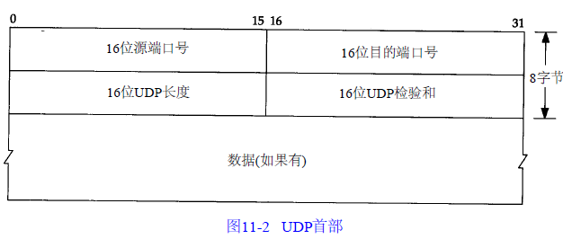
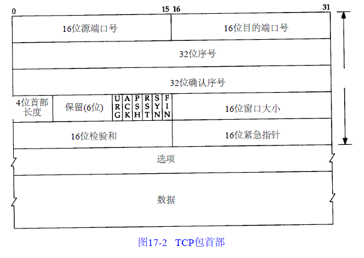
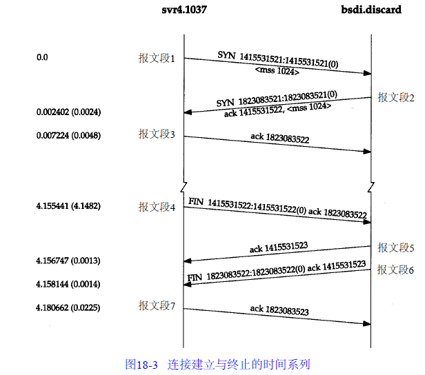
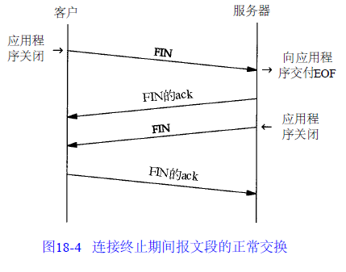

<!-- MarkdownTOC -->

- [运输层](#运输层)
    - [UDP：用户数据报协议](#udp：用户数据报协议)
        - [UDP首部](#udp首部)
    - [TCP：传输控制协议](#tcp：传输控制协议)
        - [TCP连接的建立和终止](#tcp连接的建立和终止)
            - [建立连接的三次握手](#建立连接的三次握手)
            - [关闭连接的四次握手](#关闭连接的四次握手)
            - [最大报文长度MSS](#最大报文长度mss)
            - [TCP半关闭](#tcp半关闭)
            - [报文段最大生存时间MSL](#报文段最大生存时间msl)
            - [经受时延的确认](#经受时延的确认)
            - [Nagle算法](#nagle算法)
            - [窗口大小通告](#窗口大小通告)
            - [滑动窗口协议](#滑动窗口协议)
            - [慢启动](#慢启动)
        - [TCP超时与重传](#tcp超时与重传)
            - [拥塞避免算法](#拥塞避免算法)

<!-- /MarkdownTOC -->

# 运输层
## UDP：用户数据报协议
### UDP首部

端口号表示发送进程和接收进程，IP层将数据报分配给TCP或UDP，因此TCP端口号和UDP端口号是相互独立的

UDP字段长度指的是UDP首部和UDP数据的字节长度，该字段的最小值为8

UDP校验和覆盖UDP首部和UDP数据，IP首部的校验和只包含IP首部数据

UDP收到报文校验失败后，这个报文会被丢弃，不产生任务差错报文

IP数据报分片后，只有到达目的地才进行重新组装，由目的主机IP层完成

## TCP：传输控制协议
TCP提供可靠的，面向连接的字节流服务

在一个TCP连接中，只有两方进行彼此通信

保证可靠性：
+ 应用程序数据被分割成TCP最适合发送的数据块，应用程序产生UDP数据报长度保持不变
+ TCP发送数据报之后，会启动一个定时器，等待接收方发送确认，如果超时，则会重发这个数据报
+ TCP接收到数据后，并不会立即发送确认
+ TCP使用首部的校验和对TCP数据进行校验
+ TCP对收到的数据报进行重新排序
+ TCP提供流量控制

TCP首部

TCP提供全双工，数据在两个方向独立传送，因此连接的每一端都保持数据序号

TCP将用户数据打包构成报文段，发送数据后启动一个定时器，另一端对接收到的数据进行确认，对失序的报文段进行重拍，丢弃重复数据，TCP提供端到端的流量控制，并计算和验证一个强制性的端到端校验和。

### TCP连接的建立和终止
TCP是一个面向连接的协议，在发送数据之前，都必须在双方之间建立一条连接，而UDP直接发送数据。

#### 建立连接的三次握手

+ 客户端发送一个SYN段指明客户请求建立连接，这个SYN段为1
+ 服务器发回SYN作为应答
+ 客户端发送ACK确认，至此连接建立

#### 关闭连接的四次握手
TCP连接是全双工的,因此每个方向必须进行单独的关闭

+ 主动关闭方发出FIN
+ 被动关闭方发送FIN信号的ACK确认，随后发送FIN
+ 主动关闭方接收到ACK，关闭连接，发送FIN信号的ACK确认
+ 被动方接收到ACK，关闭连接

#### 最大报文长度MSS
最大报文的长度表示TCP发送给另一端的最大数据块的长度

#### TCP半关闭
TCP提供连接的一端在结束发送之后，还能接收另一端数据

#### 报文段最大生存时间MSL
任何报文段在丢弃之前在网络内的最长时间

TCP执行一个主动关闭，并发回最后一个ACK，该连接必须爱TIME_WAIT状态停留2MSL时间，这样让TCP再次发送最后的ACK防止这个ACK丢失

#### 经受时延的确认
TCP在接收数据之后，并不会立即发送ACK确认，它推迟发送，以便ACK与需要沿该方向发送的数据一起发送，通常这个时延为200ms

#### Nagle算法
该算法减少网络拥塞，要求一个TCP连接上最多只有一个未被确认的未完成的分组，在该分组的确认到达之前不能发送数据。

这个算法是自适应的：确认到达的越快，数据发送的越快

但是是已增加连接的时延为代价的，它使得网络上的小数据报较少。

#### 窗口大小通告
TCP连接的流量控制通过通告窗口实现，它表明TCP缓存大小，让发送方不会发送大于这个缓冲区的数据到接受方

#### 滑动窗口协议

#### 慢启动
慢启动为发送方TCP增加了拥塞窗口
+ 拥塞窗口初始化为1,
+ 每接受一个ACK，拥塞窗口就增加一个报文段

发送方取拥塞窗口和通告窗口的最小值作为发送上限。拥塞窗口是发送方的流量控制，通告窗口是接受方的流量控制

进行成成块数据有效传输最重要的方法是滑动窗口协议。

### TCP超时与重传
TCP通过发送确认来提供可靠的数据传输，但是数据和确认都可能丢失。TCP通过设置定时器来解决，如果定时器溢出没有收到确认，则重发数据。

TCP定时器
+ 重传定时器，用于接收发送数据的确认
+ 坚持计时器，交换连接双方的滑动窗口大小信息
+ 保活定时器，用于检测一个空闲连接的另一端何时崩溃或重启
+ 2MSL定时器，用于测量一个连接处于TIME_WAIT状态的时间

#### 拥塞避免算法
拥塞避免算法和慢启动是两个目的不同，独立的算法，当拥塞发生时，使用慢启动达到降低发送到网络上的分组数目。

拥塞避免算法和慢启动算法需要对每个连接维持两个变量：一个拥塞窗口`cwdn`，一个慢启动门限`ssthresh`

算法过程：
+ 对于一个给定的连接，`cwnd`设置为1，`ssthresh`设置为65535
+ 拥塞发生时（超时或者受到重复确认），`ssthresh`被设置为当前窗口的一般
+ 发送的数据被确认之后，增加`cwdn`，但是增加的方法依赖于这个连接正在进行慢启动还是拥塞避免，如果`cwdn`小于等于`ssthresh`，则正在进行慢启动，否则进行拥塞避免。慢启动时`cwdn`指数级增长，拥塞避免时没收到一个确认将`cwdn`增加`cwdn/1`
